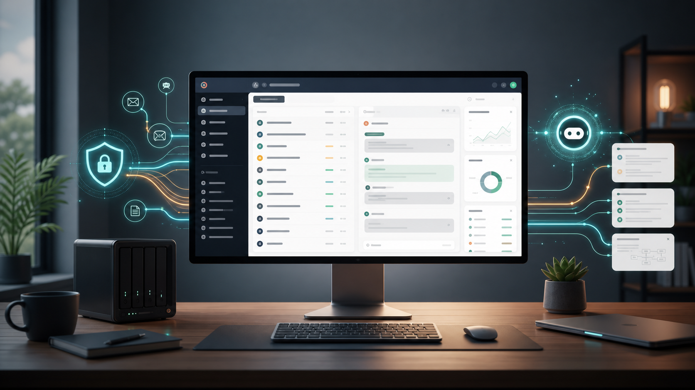

# HelixDesk AI



HelixDesk AI is a local-first support desk for teams that want AI triage, knowledge retrieval, and reply drafting without sending customer conversations to hosted AI APIs.

## Features

- Ticket queue with status, priority, category, assignee, SLA, and full conversation history.
- Local AI triage with sentiment, urgency, tags, summaries, next steps, and reply drafts.
- Optional Ollama integration for richer analysis, with an offline rules-based fallback.
- Knowledge base CRUD with search and AI article matching.
- Agent composer with AI draft insertion and internal notes.
- Resolve/reopen workflow with SLA countdowns and persistent unsent reply drafts.
- Analytics for queue health, priority mix, category mix, and SLA risk.
- JSON import/export for local backups and migration.
- No required build step, backend, account, or cloud API.

## Quick Start

```bash
cd helixdesk-ai
npm run dev
```

Open [http://localhost:4173](http://localhost:4173).

The app ships with sample tickets and articles. Data is saved in your browser's `localStorage`.

## Optional Local AI

Install and run Ollama, then pull a model:

```bash
ollama pull llama3.1
ollama serve
```

In HelixDesk AI, open **Settings**, keep the endpoint as `http://localhost:11434`, set the model, and run **Test connection**. If Ollama is offline or blocked by the browser, HelixDesk AI falls back to local deterministic triage.

## Product Scope

HelixDesk AI is designed for local operators, internal IT teams, founder-led support, and open source maintainers who need a private desk before adopting heavier helpdesk platforms.

Current product surfaces:

- Desk: daily agent queue and reply workflow.
- Knowledge: searchable local articles and runbooks.
- Analytics: operational readout for support health.
- Settings: organization profile, AI provider, model, tone, and data controls.

## Data Model

All app state is stored under the `helixdesk:v1` browser storage key. Export from **Settings** to create a portable JSON backup.

## Development

This project is intentionally framework-free for the first public build. The core is plain HTML, CSS, and ES modules.

```bash
npm test
npm run build
```

`npm run build` validates the static app contract. There is no bundled artifact yet because the app ships as plain ES modules.

## Roadmap

- File attachment indexing.
- Multi-agent shared backend mode.
- IMAP and webhook ingestion.
- Embedding-backed knowledge retrieval.
- Desktop package for offline deployments.

## License

MIT. See [LICENSE](LICENSE).
